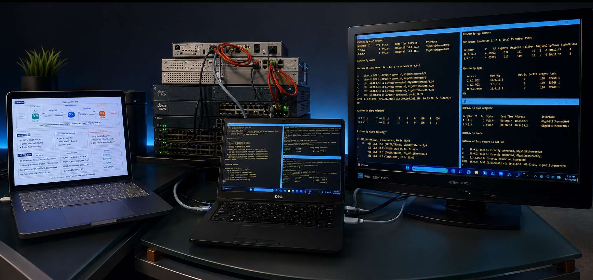

# 👋 Hi, I'm Elroy Noel

## Network Engineer | CCNA | FSNA | CCNP ENCOR Student

I'm passionate about enterprise networking and building hands-on Cisco labs using real Cisco hardware. This GitHub documents my journey as I continue developing the skills required for Enterprise Network Engineering through practical labs, troubleshooting, and technical documentation.

---

## 🚀 Current Focus

- Border Gateway Protocol (BGP)
- OSPF Multi-Area Networks
- EIGRP
- Route Reflectors
- BGP Confederations
- MPLS Concepts
- Network Automation (Python)

---

## 🏠 Home Lab

### Routers
- Cisco 3825
- Cisco 2911
- Cisco 1841

### Switches
- Cisco Catalyst 2960-X

### Tools
- GitHub
- LinkedIn
- Packet Tracer
- GNS3
- Wireshark

---

## 📜 Certifications

- ✅ Cisco Certified Network Associate (CCNA)
- ✅ FSNA

---

## 📂 Portfolio Projects

These repositories document enterprise networking labs that I have built, verified, documented, and troubleshot.

| Project | Status |
|---------|--------|
| Enterprise Campus Network Foundation | ✅ Complete |
| Enterprise Multi-Branch OSPF Network | ✅ Complete |
| Enterprise EIGRP Multi-Site Network | ✅ Complete |
| eBGP Transit AS | 🚧 Coming Soon |
| eBGP Multihop | 🚧 Coming Soon |
| iBGP Full Mesh | 🚧 Coming Soon |
| Route Reflector | 🚧 Coming Soon |
| BGP Confederation | 🚧 Coming Soon |
| BGP Path Manipulation | 🚧 Coming Soon |

---

# 🖥️ Enterprise Cisco Home Lab

### Lab Purpose

This physical Cisco home lab complements my Packet Tracer projects by providing hands-on experience with enterprise networking technologies. I use this environment to configure, verify, troubleshoot, and document real Cisco IOS deployments as part of Project ELEVATE.

### Equipment

- Cisco ISR 3825
- Cisco ISR 2911
- Cisco 1841
- Cisco Catalyst 2960-X
- Cisco Catalyst 2960
- Windows Workstation
- macOS Workstation

### Technologies

- OSPF
- EIGRP
- BGP
- VLANs
- Router-on-a-Stick
- NAT/PAT
- ACLs
- DHCP
- SSH
- Enterprise Documentation

----
 
## 🎯 2026 Goals

- Complete CCNP ENCOR studies
- Build an enterprise networking portfolio
- Learn Python for Network Automation
- Continue documenting every lab

---

## 🤝 Connect With Me

- LinkedIn: https://www.linkedin.com/in/elroy-noel-8b903085
- GitHub: https://github.com/elroynoel-ctrl

---

> *"Every lab in this portfolio represents real hands-on practice using enterprise networking concepts and professional documentation."*
